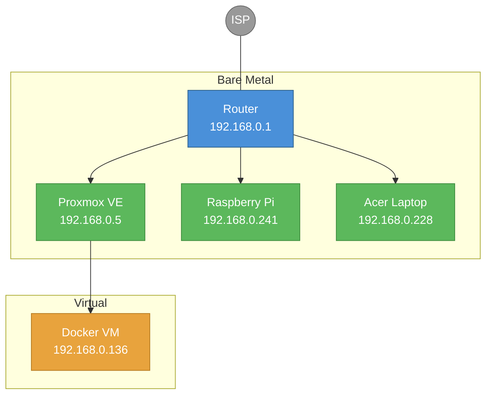
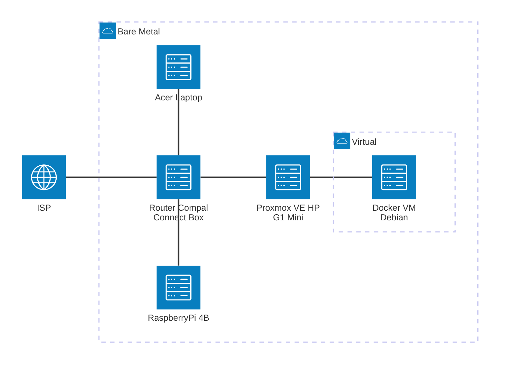
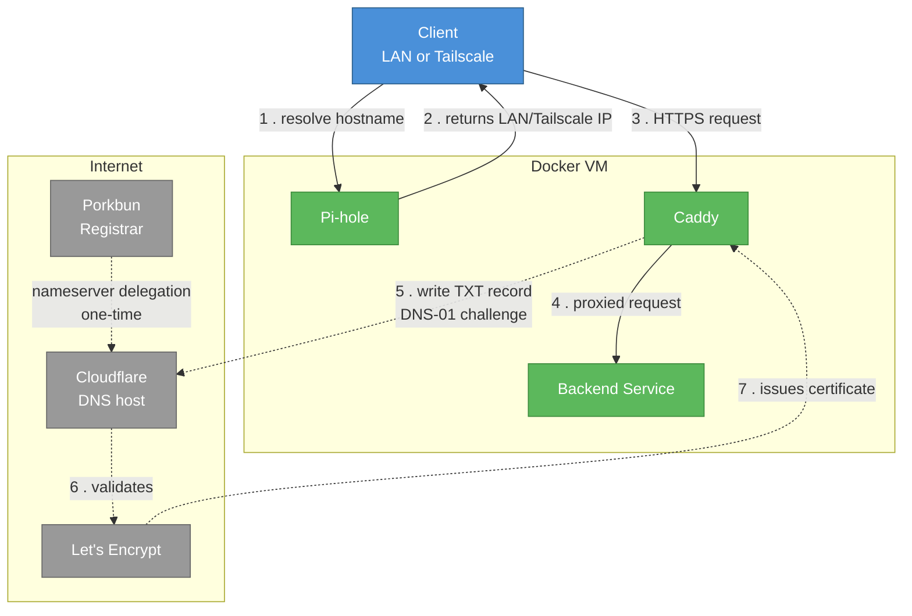
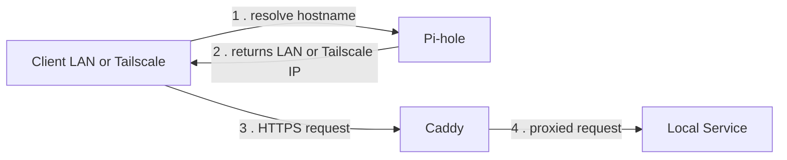
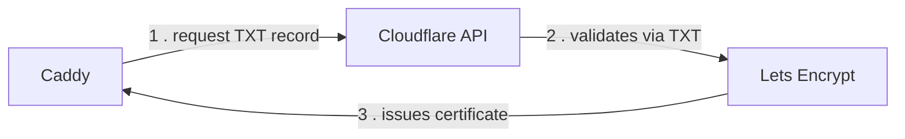

# Casa Mia Network

Home network and homelab documentation — topology, IP allocation, and node configuration.
For deployment details refer to the [Casa Mia Network Infrastructure Repository](https://github.com/AlexSzczygielski/casa-mia-net-infrastructure)

## Topology



## Components



## Network layout

| Range | Purpose |
|---|---|
| `192.168.0.0/24` | Home LAN |
| `192.168.0.1` | Router / gateway / DNS |
| `192.168.0.2 – .9` | Reserved for static hosts |
| `192.168.0.10 – .254` | Router DHCP pool |

## Nodes

| Host | IP (LAN DHCP Reservation) | Tailscale | Role | Notes |
|---|---|---|---|---|
| Proxmox VE | `192.168.0.5` | YES | Hypervisor node | See [hardware/g1-mini.md](hardware/g1-mini.md) |
| Docker VM | `192.168.0.136` | YES | Docker host (VM on Proxmox) | Debian 12, fixed via DHCP reservation |
| Acer Laptop | `192.168.0.228` | — | Windows PC, remote desktop | Fixed via DHCP reservation |
| Raspberry Pi | `192.168.0.241` | — | Remote Wake-on-LAN | No SSH exposed — see [vps-wake-on-lan-no-ssh](https://github.com/AlexSzczygielski/vps-wake-on-lan-no-ssh). Fixed via DHCP reservation |

## Access

**Local**:
```bash
ssh user@<node_ip_address>
```

**Remote** (via Tailscale, point-to-point, no port forwarding):
```bash
ssh user@<tailscale_ip_address>
```
```bash
ssh user@<MagicDNS_hostname>
```
> [!NOTE]
> Requires Tailscale client installed and logged into the tailnet on both peers. Device list: [Tailscale admin console](https://login.tailscale.com/admin/machines).

## Network Services

| Layer | Solution | Notes |
|---|---|---|
| L2/L3 switching | None | Current router is limited, no VLANs |
| DHCP | Router (manual/static leases) | No dedicated DHCP server yet - current router limitation |
| DNS | Pi-hole (LAN, manually configured per device), Tailscale split DNS (tailnet) | See [Local DNS & TLS](#local-dns--tls) and [Remote DNS & TLS](#remote-dns--tls) below |
| TLS/Certificates | Real, publicly-trusted Let's Encrypt certificates, issued via Cloudflare DNS-01 | Covers both the LAN and Tailscale domains — see below. No self-signed certs or browser warnings for any Caddy-fronted service |
| Reverse proxy | Caddy | Terminates TLS for all proxied services; see the infra repo's [`caddy/README.md`](https://github.com/AlexSzczygielski/casa-mia-net-infrastructure/blob/main/caddy/README.md) for more info |
| Remote access | Tailscale | Point-to-point mesh, per-device client. See [Access](#access) |
| Monitoring | Portainer, Uptime Kuma | Container management + uptime checks |

## Local DNS & TLS

Local hostname resolution and trusted HTTPS now both work, via a domain
this network actually owns rather than a free dynamic-DNS subdomain.

> [!TIP]
> A domain requires two distinct roles — a registrar, which owns the
registration, and a DNS host, which is authoritative for the zone's
records. These need not be the same provider. Caddy proves domain control
to Let's Encrypt via a DNS-01 challenge: a temporary TXT record written
through the DNS host's API. This requires no public-facing web server or
open inbound port, which is what makes certificate issuance possible
despite the ISP's CGNAT precluding inbound connections entirely. The
resulting certificate is a standard, publicly-trusted artifact for a domain
that is never itself publicly reachable — reachability is governed
independently, by local DNS resolution (Pi-hole), and is scoped to devices
on the LAN or tailnet only.

**Components:**

| Role | Solution |
|---|---|
| Domain | `casamia-net.top` |
| Registrar | [Porkbun](https://porkbun.com/account/login) |
| DNS host | [Cloudflare](https://dash.cloudflare.com) (nameservers delegated from Porkbun) |
| Certificate issuance | Caddy, DNS-01 challenge via Cloudflare's API |
| Local resolution | Pi-hole, wildcard DNS records |
| Reverse proxy / TLS termination | Caddy |

**Where this runs:**



**Request flow (day-to-day use):**



**Certificate issuance (DNS-01, one-time / renewal):**



Two domain patterns exist per service — `<service>.casamia-net.top` for LAN,
`<service>.ts.casamia-net.top` for Tailscale — resolved differently by
Pi-hole depending on which one is queried. This is not automatic
network-aware routing (a single URL that follows you between networks);
it's two fixed, separate URLs. Full reasoning and the tradeoffs involved are
documented in the infra repo's [`pihole/README.md`](https://github.com/AlexSzczygielski/casa-mia-net-infrastructure/blob/main/pihole/README.md).

> [!IMPORTANT]
> **DNS is still manually configured per device, not network-wide.** The ISP
> router doesn't expose a field to push a custom DNS server via DHCP — but
> separately, and more importantly, this network has other household
> members on it, so even if the router allowed it, pushing Pi-hole as the
> network-wide DNS server isn't something to do unilaterally. Devices that
> want Pi-hole resolution (and therefore access to `casamia-net.top`
> services) have their DNS set manually, per device, to `192.168.0.136`.
> Unconfigured devices fall back to the router's own DNS and simply can't
> resolve these hostnames — expected, not a bug.

<details>
<summary>Why not DuckDNS free domain?</summary>

DuckDNS was the original plan (see the collapsed history below), but using
it with Caddy for DNS-01 requires compiling a third-party DNS provider
module directly into the Caddy binary — a small, community-maintained
module with limited scrutiny, running with the same process privileges as
Caddy itself (certificate private keys, network position on the internal
Docker network). Cloudflare's equivalent module is far more widely used and
audited. Migrating also solved a separate, harder blocker: DuckDNS
subdomains can't be delegated to a real DNS host at all, since Cloudflare
requires actual registrar-level control, which a free subdomain of someone
else's domain never provides. Full reasoning in the infra repo's
[`caddy/README.md`](https://github.com/AlexSzczygielski/casa-mia-net-infrastructure/blob/main/caddy/README.md).
</details>

<details>
<summary>Constraints that shaped this design</summary>

| Constraint | Detail |
|---|---|
| No custom DNS via DHCP | Router's DHCP settings don't expose a field to hand out a DNS server other than the ISP's own. Local hosts must be configured individually. |
| No bridge mode | ISP router locks this down in practice; adding another router not pursued as a workaround. |
| Public CA certs need a real hostname | Certs are bound to a name (SAN), checked during the TLS handshake before any HTTP request is seen. Private IPs can't get a publicly-trusted cert at all (CA/Browser Forum rule — no global uniqueness guarantee). This is the core reason a real owned domain plus DNS-01 was necessary rather than any IP-based alternative. |
| CGNAT / no port forwarding | ISP is CGNAT/DS-Lite — inbound connections from the public internet aren't possible at all. This is actually what makes the setup *safe*: nothing here is ever reachable from outside the LAN/tailnet, regardless of DNS or certificates existing. |

</details>

## Remote DNS & TLS

Handled via Tailscale's split DNS feature, layered on top of the same
Pi-hole + Caddy setup above — not a separate mechanism.

| Layer | Solution |
|---|---|
| Name resolution | Tailscale **restricted nameserver**: tailnet queries for `casamia-net.top` and its subdomains are routed to Pi-hole's Tailscale IP; everything else still uses MagicDNS normally |
| Certificates | Same real Let's Encrypt certificates as the LAN side — Caddy's certificate for `*.ts.casamia-net.top` covers this, not a separate Tailscale-issued cert |
| Reachability | Point-to-point over the tailnet, no port forwarding, unaffected by CGNAT |

> [!NOTE]
> This intentionally does **not** use `tailscale cert` or MagicDNS-based
> hostnames for these services — the domain-based approach above already
> covers Tailscale clients with real, trusted certificates, so a second,
> separate certificate mechanism isn't needed.

## Services

Full, current list of proxied services lives in the infra repo's Caddyfile,
not duplicated here. A couple of examples to show the pattern:

| Service | LAN | Tailscale |
|---|---|---|
| Pi-hole | `https://pihole.casamia-net.top` | `https://pihole.ts.casamia-net.top` |
| Vaultwarden | `https://vaultwarden.casamia-net.top` | `https://vaultwarden.ts.casamia-net.top` |

See [`caddy/README.md`](https://github.com/AlexSzczygielski/casa-mia-net-infrastructure/blob/main/caddy/README.md) in the infrastructure repo for the complete, current list.

## Status

- [x] Proxmox VE installed, static IP + SSH key auth configured
- [x] Docker VM created and reachable
- [x] Tailscale installed on Docker VM, remote SSH confirmed working
- [x] Tailscale installed on Proxmox VE
- [x] Pi-hole installed on Docker VM — local DNS + ad-blocking, privacy level 3 (no query/client logging)
- [x] Domain registered (`casamia-net.top`, via Porkbun)
- [x] DNS delegated to Cloudflare (nameservers switched at Porkbun)
- [x] Caddy deployed — reverse proxy + automatic TLS via Cloudflare DNS-01
- [x] Pi-hole wildcard DNS for LAN + Tailscale domain split
- [x] Tailscale split DNS (restricted nameserver) configured for the tailnet
- [x] Homepage dashboard deployed
- [ ] Vaultwarden deployed behind Caddy