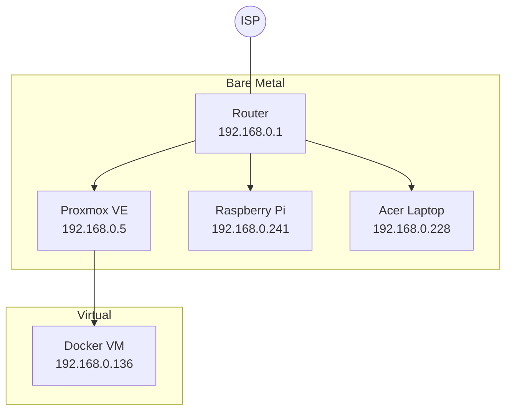
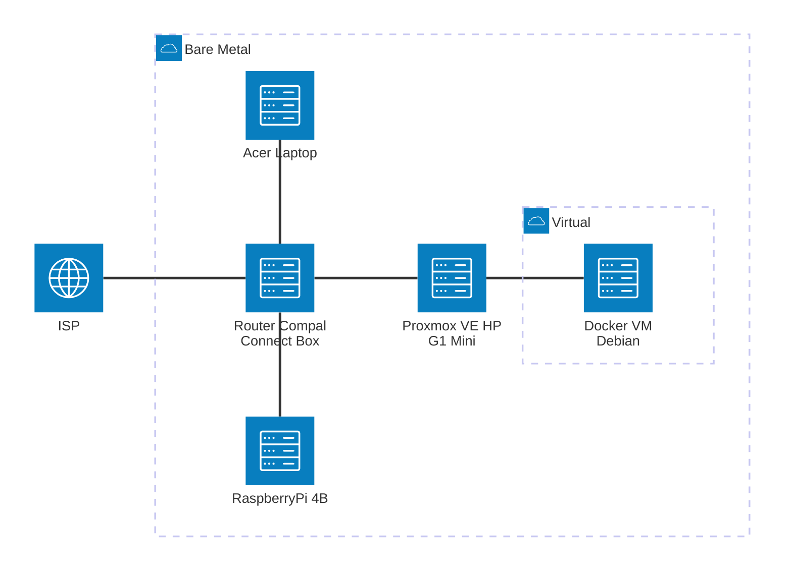

# Casa Mia Network

Home network and homelab documentation — topology, IP allocation, and node configuration.

## Topology



## Components



## Network layout

| Range | Purpose |
|---|---|
| `192.168.0.0/24` | Home LAN |
| `192.168.0.1` | Router / gateway / DNS |
| `192.168.0.2 – .9` | Reserved for static hosts |
| `192.168.0.10 – .254` | Router DHCP pool |

## Nodes

| Host | IP (LAN DHCP Reservation) | Tailscale | Role | Notes |
|---|---|---|---|---|
| Proxmox VE | `192.168.0.5` | YES | Hypervisor node | See [hardware/g1-mini.md](hardware/g1-mini.md) |
| Docker VM | `192.168.0.136` | YES | Docker host (VM on Proxmox) | Debian 12, fixed via DHCP reservation |
| Acer Laptop | `192.168.0.228` | — | Windows PC, remote desktop | Fixed via DHCP reservation |
| Raspberry Pi | `192.168.0.241` | — | Remote Wake-on-LAN | No SSH exposed — see [vps-wake-on-lan-no-ssh](https://github.com/AlexSzczygielski/vps-wake-on-lan-no-ssh). Fixed via DHCP reservation |

## Access
**Local**:
```bash
ssh user@<node_ip_address>
```

**Remote** (via Tailscale, point-to-point, no port forwarding):
```bash
ssh user@<tailscale_ip_address>
```
```bash
ssh user@<MagicDNS_hostname>
```
> Requires Tailscale client installed and logged into the tailnet on both peers. Device list: [Tailscale admin console](https://login.tailscale.com/admin/machines).

## Network Services

| Layer | Solution | Notes |
|---|---|---|
| L2/L3 switching | None | Current router is limited, no VLANs |
| DHCP | Router (manual/static leases) | No dedicated DHCP server yet - current router limitation|
| DNS | None locally; MagicDNS for tailnet | Local hosts referenced by IP; Tailscale nodes resolve by tailscale's hostname (`docker-vm`, etc.) via MagicDNS - see [tailscale admin panel](https://console.tailscale.com/admin/machines)|
| TLS/Certificates | None (local); Tailscale-issued available **not set up** | Local services use plain HTTP or self-signed certs (e.g. Proxmox's default) — browser warnings expected. Tailscale can issue valid HTTPS certs per-node via `tailscale cert`, but not yet set up. |
| Reverse proxy | None | Services reached directly by IP:port |
| Remote access | Tailscale | Point-to-point mesh, per-device client. See [Access](#access) |
| Monitoring | Portainer, Uptime Kuma | Container management + uptime checks |

## Services

| Service | URL | Runs on |
|---|---|---|
| Proxmox web UI | [https://192.168.0.5:8006](https://192.168.0.5:8006) | Proxmox VE |
| Portainer | [https://192.168.0.136:9443](https://192.168.0.136:9443) | Docker VM |

## Status

- [x] Proxmox VE installed, static IP + SSH key auth configured
- [x] Docker VM created and reachable
- [x] Tailscale installed on Docker VM, remote SSH confirmed working
- [x] Tailscale installed on Proxmox VE