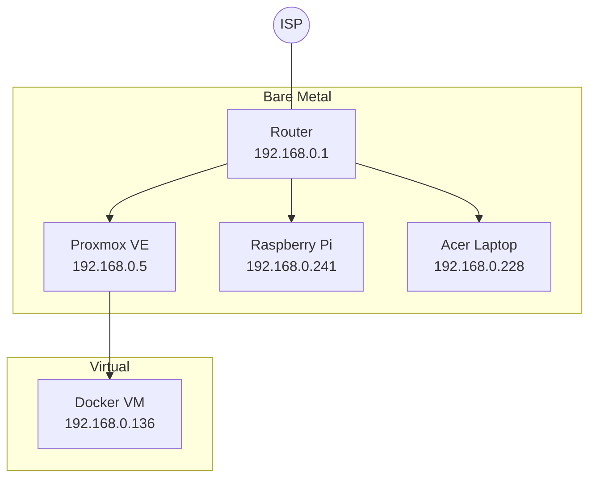
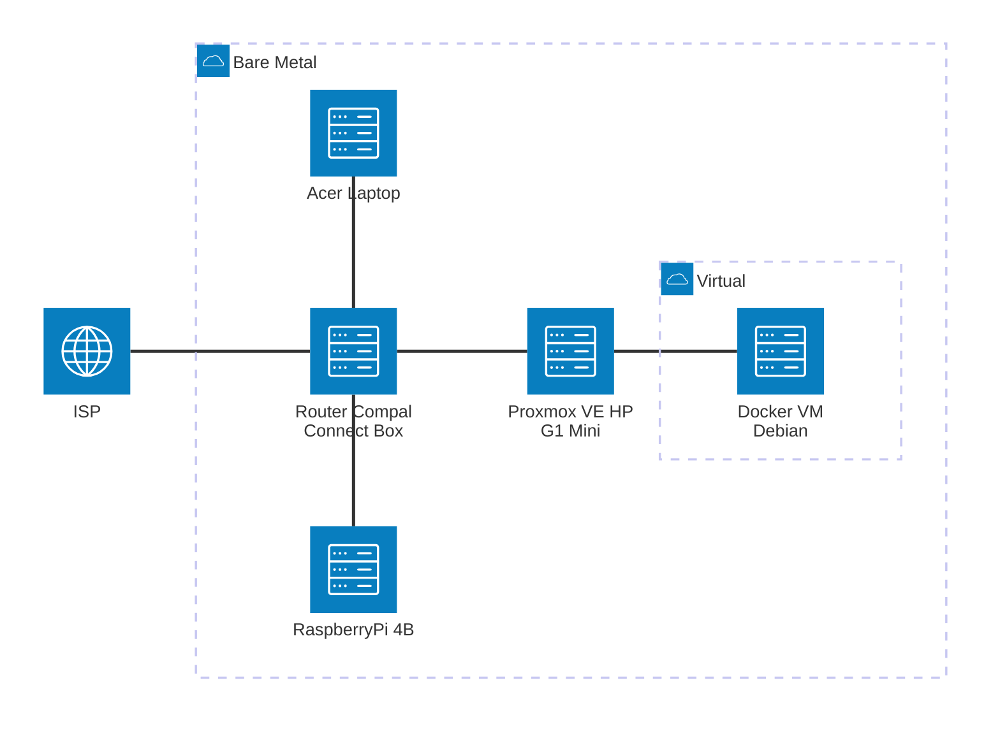
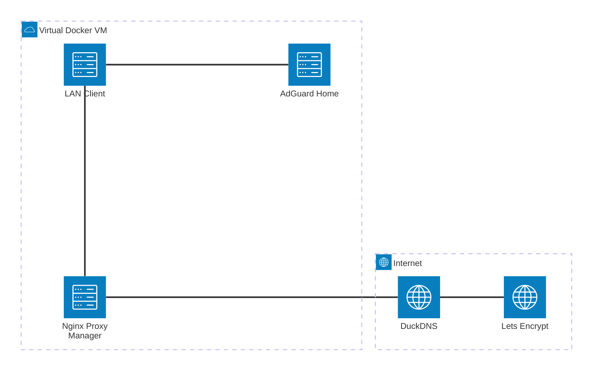
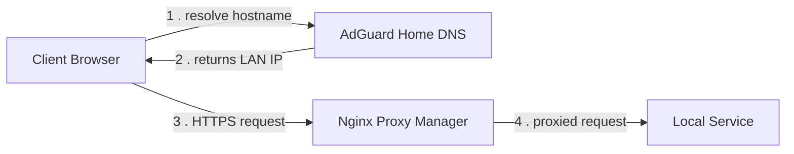
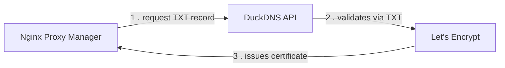

# Casa Mia Network

Home network and homelab documentation — topology, IP allocation, and node configuration.

## Topology



## Components



## Network layout

| Range | Purpose |
|---|---|
| `192.168.0.0/24` | Home LAN |
| `192.168.0.1` | Router / gateway / DNS |
| `192.168.0.2 – .9` | Reserved for static hosts |
| `192.168.0.10 – .254` | Router DHCP pool |

## Nodes

| Host | IP (LAN DHCP Reservation) | Tailscale | Role | Notes |
|---|---|---|---|---|
| Proxmox VE | `192.168.0.5` | YES | Hypervisor node | See [hardware/g1-mini.md](hardware/g1-mini.md) |
| Docker VM | `192.168.0.136` | YES | Docker host (VM on Proxmox) | Debian 12, fixed via DHCP reservation |
| Acer Laptop | `192.168.0.228` | — | Windows PC, remote desktop | Fixed via DHCP reservation |
| Raspberry Pi | `192.168.0.241` | — | Remote Wake-on-LAN | No SSH exposed — see [vps-wake-on-lan-no-ssh](https://github.com/AlexSzczygielski/vps-wake-on-lan-no-ssh). Fixed via DHCP reservation |

## Access
**Local**:
```bash
ssh user@<node_ip_address>
```

**Remote** (via Tailscale, point-to-point, no port forwarding):
```bash
ssh user@<tailscale_ip_address>
```
```bash
ssh user@<MagicDNS_hostname>
```
> [!NOTE]
> Requires Tailscale client installed and logged into the tailnet on both peers. Device list: [Tailscale admin console](https://login.tailscale.com/admin/machines).

## Network Services

| Layer | Solution | Notes |
|---|---|---|
| L2/L3 switching | None | Current router is limited, no VLANs |
| DHCP | Router (manual/static leases) | No dedicated DHCP server yet - current router limitation|
| DNS | Pi-hole (local), MagicDNS (tailnet) | Pi-hole (`192.168.0.136:53`) resolves **only for LAN clients configured to use it manually** (*no DHCP-pushed DNS* — router limitation, see below). Unconfigured devices have to reference services by IP; Tailscale nodes resolve by tailscale's hostname (`docker-vm`, etc.) via MagicDNS - see [tailscale admin panel](https://console.tailscale.com/admin/machines) |
| TLS/Certificates | None (local); Tailscale-issued available **not set up** | Local services use plain HTTP or self-signed certs (e.g. Proxmox's default) — browser warnings expected. Tailscale can issue valid HTTPS certs per-node via `tailscale cert`, but not yet set up. |
| Reverse proxy | None | Services reached directly by IP:port |
| Remote access | Tailscale | Point-to-point mesh, per-device client. See [Access](#access) |
| Monitoring | Portainer, Uptime Kuma | Container management + uptime checks |

## Local DNS & TLS — current limitations

Local hostname resolution and trusted HTTPS both require a DNS layer this
network doesn't have yet.

How this could work: free DNS domain via DuckDNS, TLS certificate issued through a
DNS-01 challenge, served by an nginx-based reverse proxy (Nginx Proxy
Manager) in front of local services:

**Where this would run:**



**Request flow (day-to-day use):**



**Certificate issuance (DNS-01, one-time / renewal):**



> [!CAUTION]
> Investigating this surfaced several
constraints — both in the ISP router and in how TLS/hostname resolution
work in general — which are documented below:

| Constraint | Detail |
|---|---|
| No custom DNS via DHCP | Router's DHCP settings don't expose a field to hand out a DNS server other than the ISP's own. Local hosts must be reached by IP. |
| No bridge mode | ISP router locks this down in practice; so adding another router not pursued as a workaround. |
| Public CA certs need a real hostname | Certs are bound to a name (SAN), checked during the TLS handshake before any HTTP request is seen — a reverse proxy can't redirect an IP-based request to fix this after the fact. Private IPs also can't get a publicly-trusted cert at all (CA/Browser Forum rule — no global uniqueness guarantee). |

> [!IMPORTANT]
> **Current status:** DuckDNS + DNS-01 + reverse proxy plan still holds for
issuing the certificate itself (no local dependency, no port-forwarding
needed). What it's missing is a local DNS resolver (AdGuard Home, planned)
to resolve the DuckDNS name to the reverse proxy's LAN IP for LAN clients —
router can't push this via DHCP, so it can be set per-device (manual DNS
override) rather than network-wide, at least initially.

> [!NOTE]
> **Pi-hole vs. this plan:** Pi-hole is now running on the Docker VM, providing
local DNS resolution and ad/tracker blocking only for **clients manually configured
to use it** (`192.168.0.136:53`). This solves local DNS resolution but is a
separate concern from the plan above, which is specifically about resolving
the *DuckDNS hostname* to the reverse proxy's LAN IP for trusted HTTPS.
Whether Pi-hole ends up handling that resolution role too (instead of
AdGuard Home) or the two run side by side is not yet decided.

## Remote DNS & TLS

Handled entirely by Tailscale — no local dependency, no interaction with the
limitations above.

| Layer | Solution |
|---|---|
| Name resolution | MagicDNS — tailnet nodes resolve by Tailscale hostname (`docker-vm`, etc.) |
| Certificates | `tailscale cert` can issue valid HTTPS certs per-node against Tailscale's own CA — not yet set up |
| Reachability | Point-to-point over the tailnet, no port forwarding, unaffected by CGNAT |

## Services

| Service | URL | Runs on |
|---|---|---|
| Proxmox web UI | [https://192.168.0.5:8006](https://192.168.0.5:8006) | Proxmox VE |
| Pi-hole | [http://192.168.0.136:8081/admin](http://192.168.0.136:8081/admin) | Docker VM |
| Portainer | [https://192.168.0.136:9443](https://192.168.0.136:9443) | Docker VM |

## Status

- [x] Proxmox VE installed, static IP + SSH key auth configured
- [x] Docker VM created and reachable
- [x] Tailscale installed on Docker VM, remote SSH confirmed working
- [x] Tailscale installed on Proxmox VE
- [x] Pi-hole installed on Docker VM — local DNS + ad-blocking, privacy level 3 (no query/client logging)